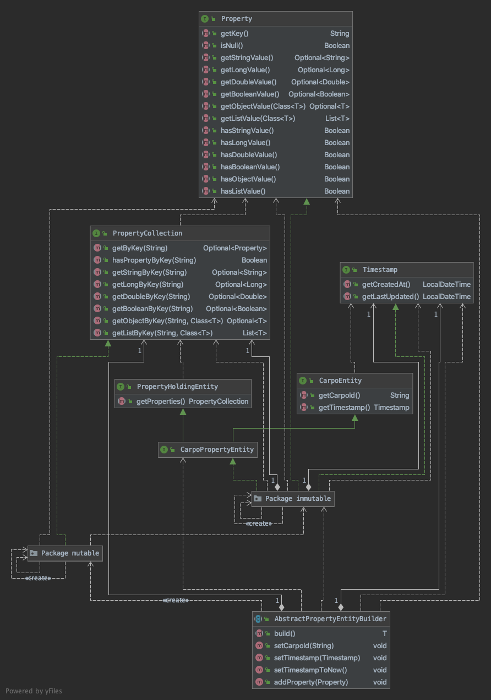

# Carpo Common

Common is the only module that all other modules should be dependent on. It provides the root interfaces and models that other modules will need. 

## Model

The model package has the top level interfaces for entities. It defines how properties work and types of entities.

Properties and entities are all immutable by design. The interfaces only include `get` methods to support this immutable design. The use of immutable data is a design decision within Carpo to promote best practices but implementing a mutable version of the data structures will not cause a problem within the system.

The [Property Concept](../concepts/properties.md) are documented separately.

## Repository

We have defined a top level repository for entities and we are expecting other repository entities to extend this.